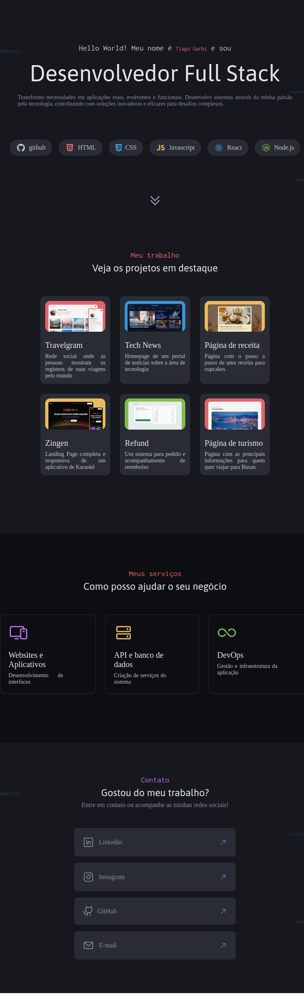

# Portfólio de Desenvolvedor



## Introdução

Olá, devs! Bem-vindos ao meu portfólio. 🚀
Este projeto é o resultado do desafio prático da Rocketseat, onde pude aplicar todo o conhecimento adquirido ao longo do curso. Desenvolver este portfólio foi uma excelente oportunidade para consolidar minhas habilidades e me preparar para os desafios reais do mercado.

---

## Descrição do Projeto

Neste projeto, desenvolvi um site de portfólio voltado para desenvolvedores. O objetivo é mostrar meus projetos e facilitar o contato com possíveis interessados.

Você pode acessar o [design do projeto no Figma aqui](https://www.figma.com/community/file/1387080701963671866/portfolio-dev).

---

## Tecnologias Utilizadas

Neste projeto, trabalhei com as seguintes tecnologias e conceitos:

- Criação de layouts com CSS
- CSS Flexbox
- Posicionamento de elementos
- CSS Grid
- Variáveis CSS
- Pseudo-classes e pseudo-elementos

---

## Como Utilizar

Para visualizar o projeto, siga os passos abaixo:

1. Clone o repositório:
   ```bash
   git clone https://github.com/seu-usuario/seu-repositorio.git

2. Navegue até o diretório do projeto:

    ```bash
    cd seu-repositorio
    ```

3. Abra o arquivo index.html no seu navegador preferido.

## Considerações Finais

Desenvolver este projeto foi uma experiência enriquecedora. Tive a oportunidade de aplicar práticas e conceitos fundamentais de CSS, o que me proporcionou um melhor entendimento sobre a criação de layouts modernos e responsivos.

Feito com 💜 por Tiago Garbi
